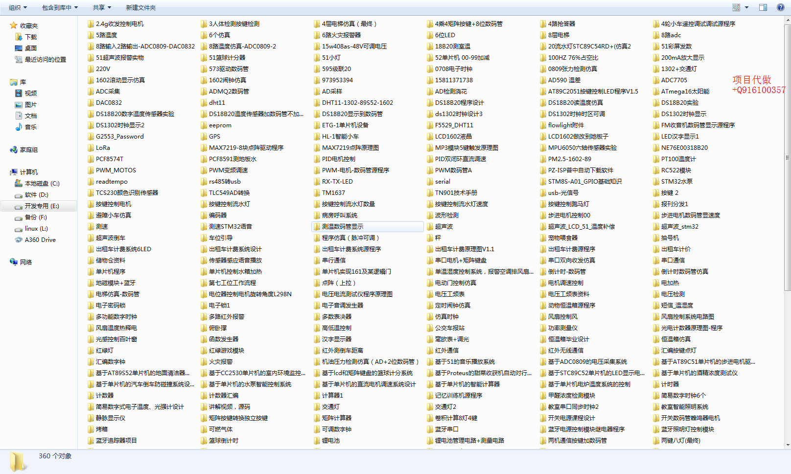

## 每周更新开源项目
本人为了方便学习使用github和消化吸收别人的项目文件，故实行每周定时更新项目，所有文件均来源于各大网站，本人对所发出的项目正确与否不做任何保证，对此作出声明。

推荐GitHub的编辑工具

   *  http://mahua.jser.me/

*  还有程序准备提交，待续

## 有问题反馈
在使用中有任何问题，或者有项目恰谈，欢迎找我，可以用以下联系方式跟我交流

* 邮件(mcutree#163.com, 把#换成@)
* QQ: 916100357(非诚勿扰)
* 微信同QQ号

